# 📊 SƠ ĐỒ HỆ THỐNG - ĐặtSân247

> File này chứa code PlantUML để vẽ các sơ đồ hệ thống.
> 
> **Cách sử dụng:**
> 1. Copy code PlantUML
> 2. Truy cập [PlantUML Online](https://www.plantuml.com/plantuml/uml/) hoặc [PlantText](https://www.planttext.com/)
> 3. Paste code và nhấn Submit để xem sơ đồ

---

## 📑 Mục lục

1. [Sơ đồ Actor](#1-sơ-đồ-actor)
2. [Sơ đồ Use Case tổng quan](#2-sơ-đồ-use-case-tổng-quan)
3. [Sơ đồ Use Case chi tiết](#3-sơ-đồ-use-case-chi-tiết)
4. [Sơ đồ Class (Entity)](#4-sơ-đồ-class-entity)
5. [Sơ đồ Sequence - Luồng hoạt động](#5-sơ-đồ-sequence---luồng-hoạt-động)
6. [Sơ đồ Activity - Quy trình](#6-sơ-đồ-activity---quy-trình)
7. [Sơ đồ Component - Kiến trúc](#7-sơ-đồ-component---kiến-trúc)
8. [Sơ đồ ERD - Database](#8-sơ-đồ-erd---database)

---

## 1. Sơ đồ Actor

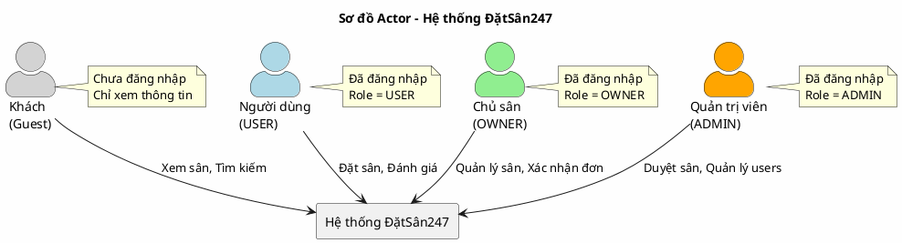

---

## 2. Sơ đồ Use Case tổng quan

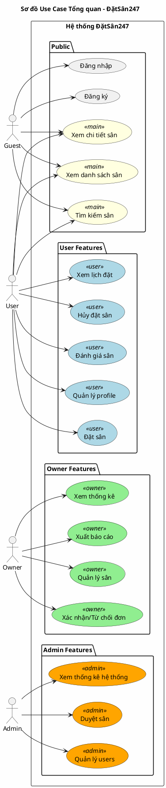

---

## 3. Sơ đồ Use Case chi tiết

### 3.1 Use Case - Đặt sân

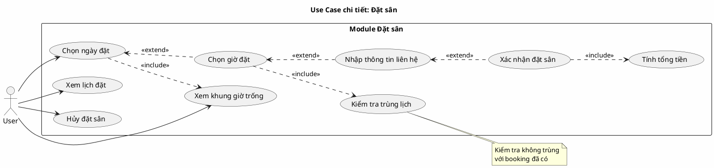

### 3.2 Use Case - Quản lý sân (Owner)

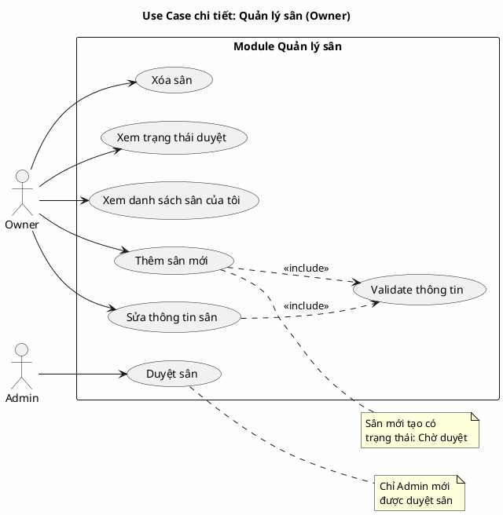

### 3.3 Use Case - Quản lý đơn đặt (Owner)

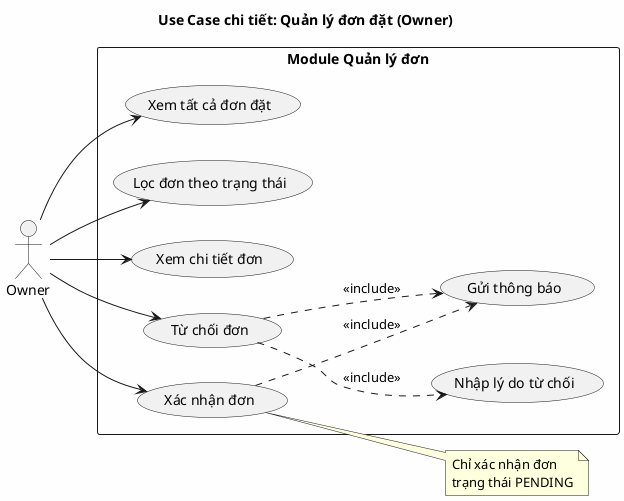

---

## 4. Sơ đồ Class (Entity)

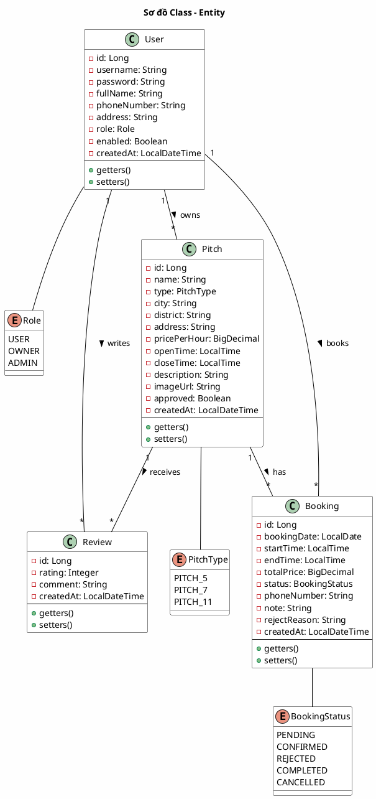

---

## 5. Sơ đồ Sequence - Luồng hoạt động

### 5.1 Sequence - Đăng nhập

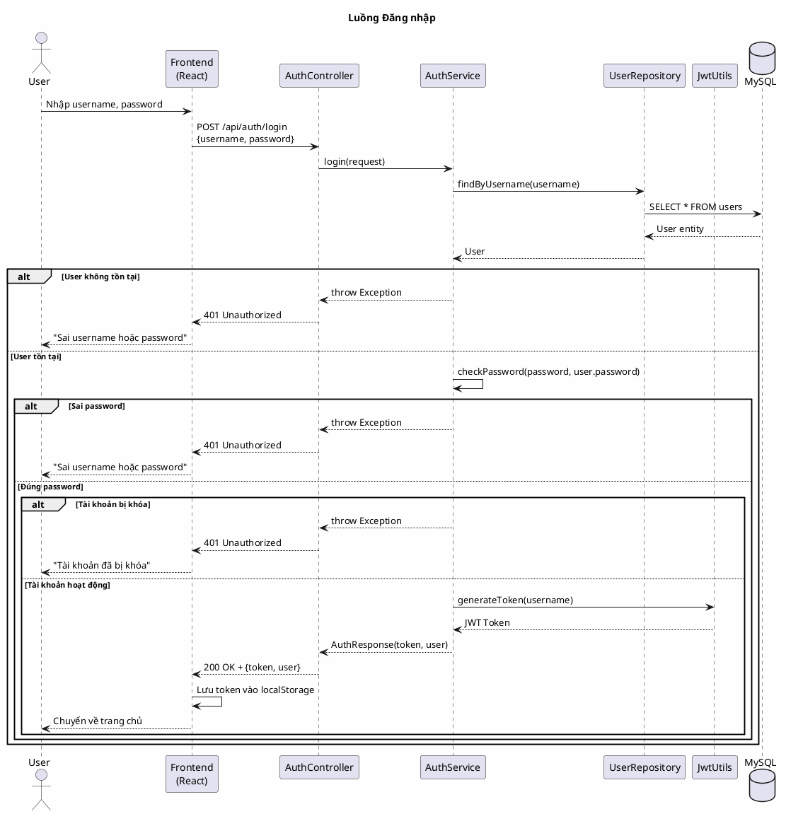

### 5.2 Sequence - Đặt sân

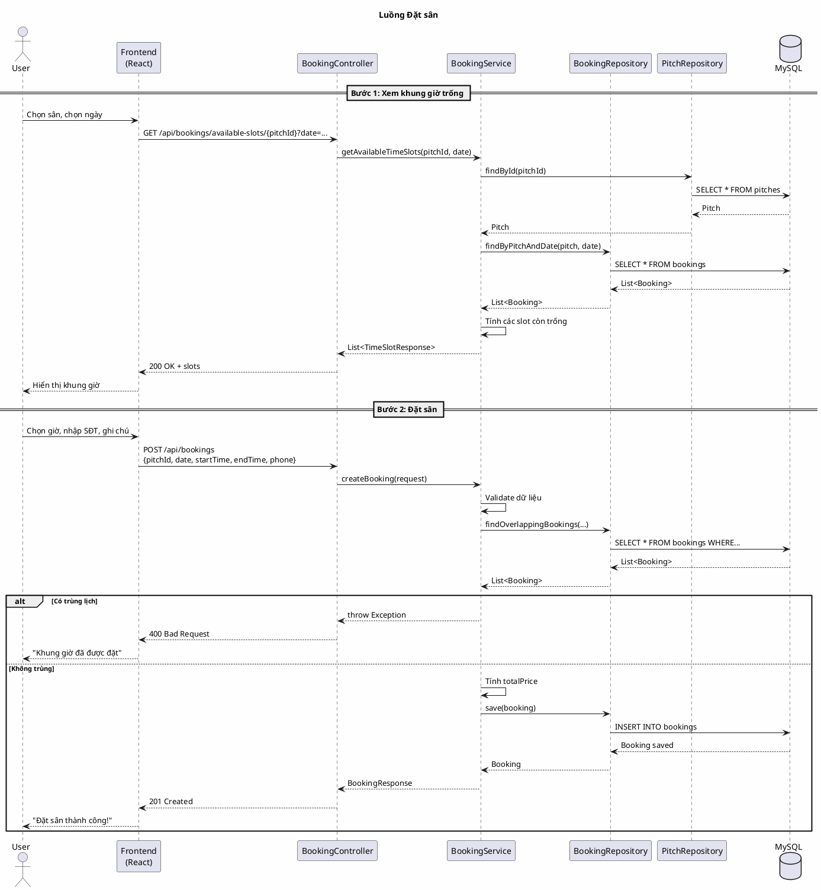

### 5.3 Sequence - Xác nhận đơn (Owner)

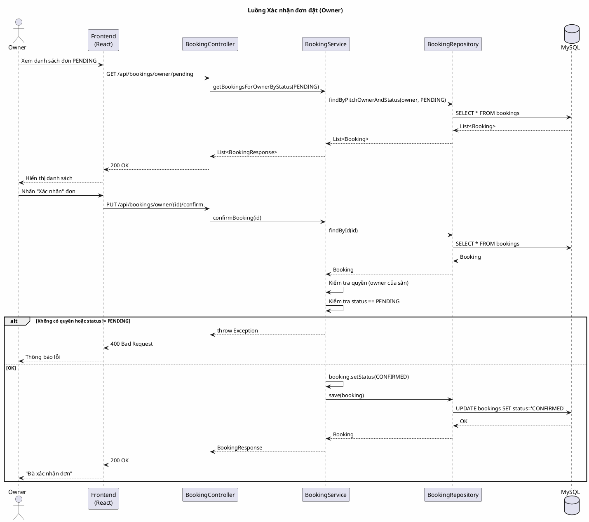

### 5.4 Sequence - Duyệt sân (Admin)

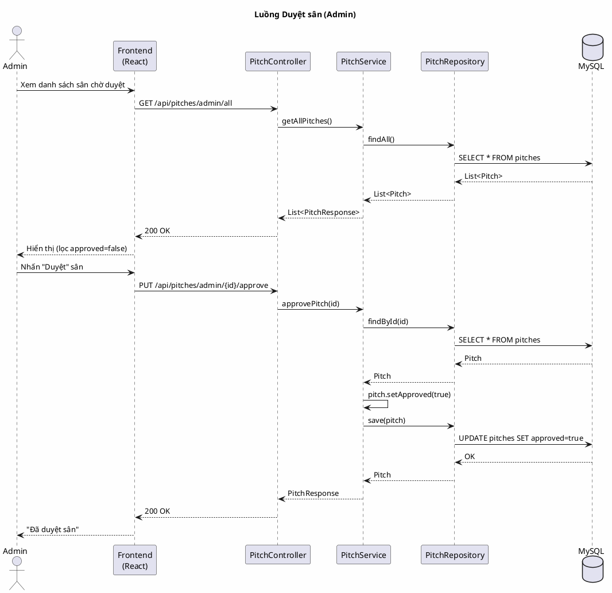

---

## 6. Sơ đồ Activity - Quy trình

### 6.1 Activity - Quy trình đặt sân hoàn chỉnh

```plantuml
@startuml Activity - Booking Process
skinparam backgroundColor #FEFEFE

title Quy trình Đặt sân hoàn chỉnh

start

:User truy cập trang chủ;

:Tìm kiếm/Lọc sân;

:Chọn sân muốn đặt;

:Xem chi tiết sân;

if (Đã đăng nhập?) then (Chưa)
    :Chuyển đến trang đăng nhập;
    :Nhập username/password;
    
    if (Đăng nhập thành công?) then (Không)
        :Hiển thị lỗi;
        stop
    else (Có)
        :Lưu token;
    endif
else (Rồi)
endif

:Chọn ngày đặt;

:Hệ thống hiển thị khung giờ trống;

:Chọn giờ bắt đầu và kết thúc;

:Nhập số điện thoại liên hệ;

:Nhập ghi chú (tùy chọn);

:Xem tổng tiền;

:Nhấn "Đặt sân";

if (Kiểm tra trùng lịch?) then (Trùng)
    :Thông báo "Khung giờ đã được đặt";
    :Quay lại chọn giờ;
    backward :Chọn giờ khác;
else (Không trùng)
endif

:Tạo booking với status = PENDING;

:Thông báo "Đặt sân thành công";

:Đơn hiển thị trong "Lịch đặt";

fork
    :User chờ xác nhận;
fork again
    :Owner nhận thông báo đơn mới;
    
    if (Owner xác nhận?) then (Xác nhận)
        :Status = CONFIRMED;
    else (Từ chối)
        :Nhập lý do;
        :Status = REJECTED;
    endif
end fork

if (Status = CONFIRMED?) then (Có)
    :User đến chơi bóng;
    :Hết giờ chơi;
    :Scheduler tự động chuyển\nStatus = COMPLETED;
    :User có thể đánh giá sân;
else (Không)
    :User nhận thông báo bị từ chối;
endif

stop

@enduml
```

### 6.2 Activity - Quy trình trạng thái Booking

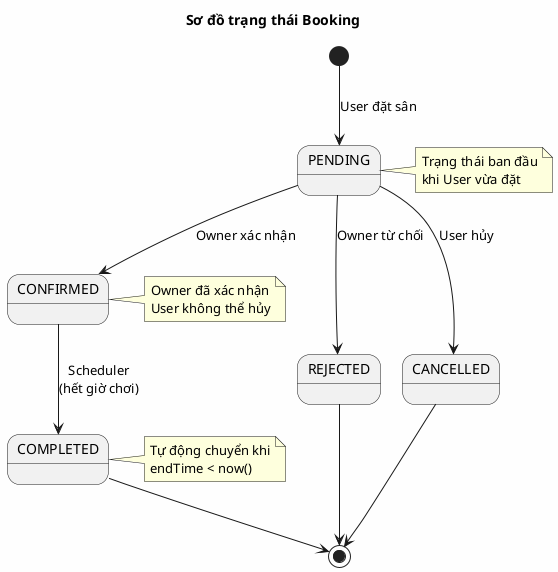

### 6.3 Activity - Quy trình đăng ký sân (Owner)

```plantuml
@startuml Activity - Register Pitch
skinparam backgroundColor #FEFEFE

title Quy trình Đăng ký sân mới (Owner)

start

:Owner đăng nhập;

:Vào "Sân của tôi";

:Nhấn "Thêm sân mới";

:Nhập thông tin sân;

note right
  - Tên sân
  - Loại sân (5/7/11)
  - Địa chỉ
  - Giá/giờ
  - Giờ hoạt động
  - Mô tả
  - Hình ảnh
end note

if (Validate thông tin?) then (Không hợp lệ)
    :Hiển thị lỗi validation;
    backward :Sửa thông tin;
else (Hợp lệ)
endif

:Tạo sân với approved = false;

:Thông báo "Tạo sân thành công, chờ duyệt";

:Sân hiển thị với nhãn "Chờ duyệt";

fork
    :Owner chờ Admin duyệt;
fork again
    :Admin xem danh sách sân mới;
    :Admin xem chi tiết sân;
    
    if (Admin duyệt?) then (Duyệt)
        :approved = true;
        :Sân hiển thị công khai;
    else (Xóa)
        :Xóa sân khỏi hệ thống;
    endif
end fork

stop

@enduml
```

---

## 7. Sơ đồ Component - Kiến trúc

### 7.1 Component - Kiến trúc tổng quan

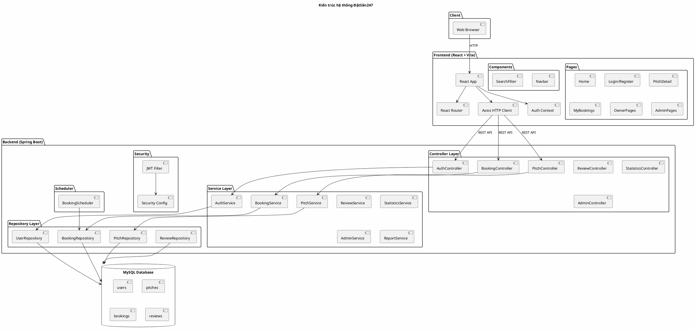

### 7.2 Component - Luồng Request/Response

```plantuml
@startuml Component - Request Flow
skinparam backgroundColor #FEFEFE

title Luồng Request/Response

actor User

node "Frontend\n:5173" as FE {
    component [React App]
    component [Axios]
}

node "Backend\n:8080" as BE {
    component [CORS Filter]
    component [JWT Filter]
    component [Controller]
    component [Service]
    component [Repository]
}

database "MySQL\n:3306" as DB

User -> [React App] : 1. Tương tác UI
[React App] -> [Axios] : 2. Gọi API
[Axios] -> [CORS Filter] : 3. HTTP Request\n+ JWT Token

[CORS Filter] -> [JWT Filter] : 4. Check CORS
[JWT Filter] -> [Controller] : 5. Validate Token

alt Token không hợp lệ
    [JWT Filter] --> [Axios] : 401 Unauthorized
else Token hợp lệ
    [Controller] -> [Service] : 6. Business Logic
    [Service] -> [Repository] : 7. Data Access
    [Repository] -> DB : 8. SQL Query
    DB --> [Repository] : 9. Result
    [Repository] --> [Service] : 10. Entity
    [Service] --> [Controller] : 11. DTO
    [Controller] --> [Axios] : 12. JSON Response
end

[Axios] --> [React App] : 13. Update State
[React App] --> User : 14. Render UI

@enduml
```

---

## 8. Sơ đồ ERD - Database

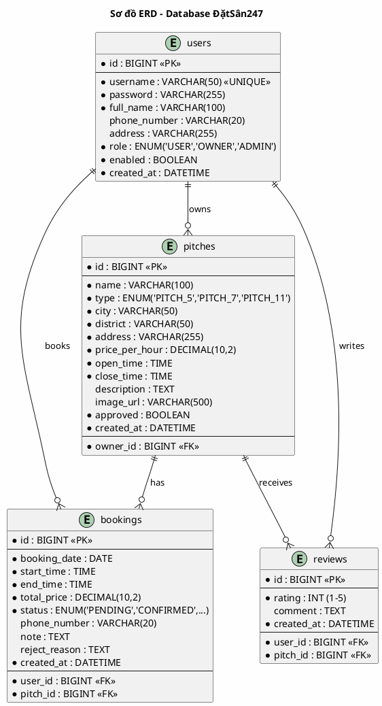

---

## 📝 Ghi chú

### Cách đọc các ký hiệu quan hệ:

| Ký hiệu | Ý nghĩa |
|---------|---------|
| `||--o{` | Một - Nhiều (1-N) |
| `}o--o{` | Nhiều - Nhiều (N-N) |
| `||--||` | Một - Một (1-1) |
| `-->` | Phụ thuộc/Sử dụng |
| `..>` | Include/Extend |

### Màu sắc trong sơ đồ:

| Màu | Ý nghĩa |
|-----|---------|
| 🔵 LightBlue | Chức năng USER |
| 🟢 LightGreen | Chức năng OWNER |
| 🟠 Orange | Chức năng ADMIN |
| 🟡 LightYellow | Chức năng chung |

---

<div align="center">
  <strong>⚽ ĐặtSân247 - System Diagrams ⚽</strong>
</div>
